# 📸 Twitter HPA — Proje Görselleri ve Çalışma Kanıtları

Bu dosya, **Twitter HPA (High Performance Analysis)** projesinin uçtan uca (Ingestion → Stream → Batch → Serving → Storage → Orchestration) sorunsuz bir şekilde çalıştığını gösteren canlı ekran görüntülerini barındırır.

---

## 1. Altyapı — Docker Konteyner Durumları (`docker compose ps`)

> Projedeki 15 konteynerin tamamının aktif ve `healthy` durumda olduğunu gösteren terminal çıktısı.

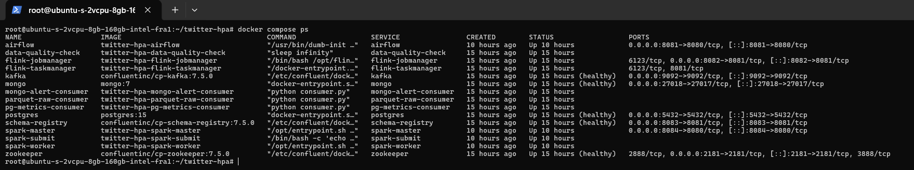

---

## 2. Real-Time (Speed) Layer — Apache Flink

### 2a. Flink Job Dashboard & Dataflow Graph

> `RUNNING` durumundaki akış işinin genel görünümü ve Kafka'dan gelen verinin 1 dakikalık pencerelerle işlendiği topoloji grafiği.

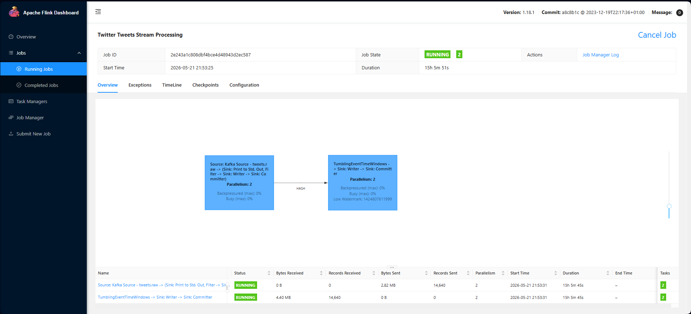

---

### 2b. Flink Checkpoints (S3 Durum Yedekleri)

> Flink'in durum yedeklerinin (state checkpoints) DigitalOcean Spaces (S3) üzerine başarıyla kaydedildiğini gösteren checkpoint geçmiş tablosu.

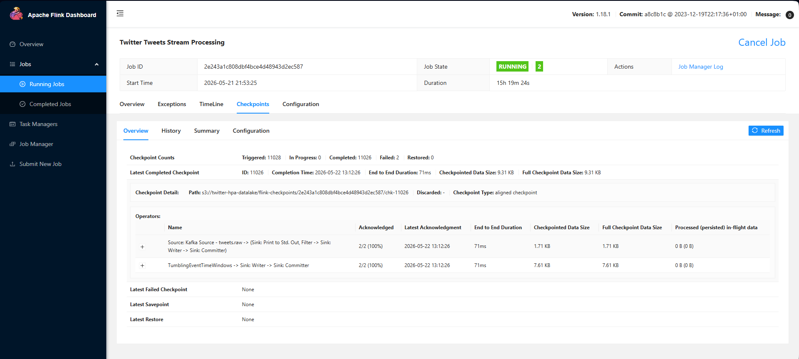

---

## 3. Batch Layer & Orchestration — Apache Airflow

### 3a. Airflow DAG Grid View

> Saatlik çalışan batch pipeline'ının son başarılı çalışmalarını gösteren yeşil grid görünümü.

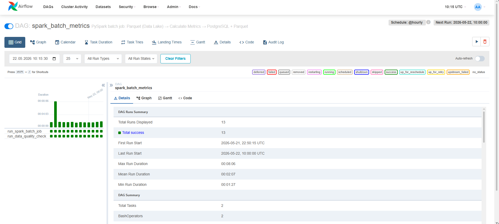

---

### 3b. Airflow DAG Graph View

> PySpark işi → Veri kalitesi kontrolü → Lambda veri temizleme adımlarının sıralı görev mimarisi.

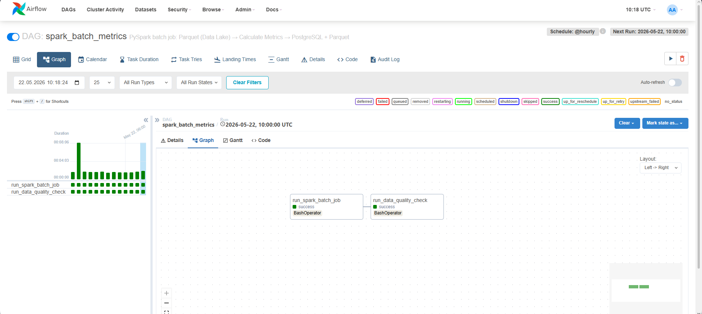

---

## 4. Batch Layer — Apache Spark Master UI

> PySpark uygulamasının Spark cluster'ına başarıyla sunulduğunu ve tamamlandığını gösteren "Completed Applications" tablosu.

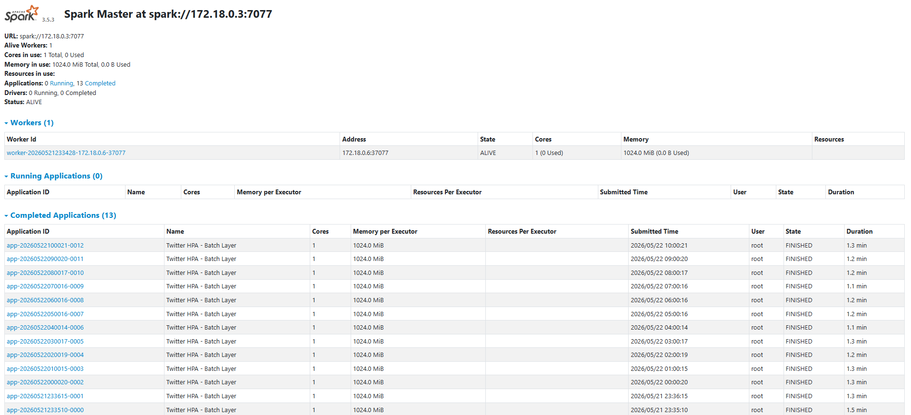

---

## 5. Cloud Data Lake — DigitalOcean Spaces (S3)

### 5a. Spaces Datalake Genel Görünümü (Toplu Görünüm)
> Flink, Spark, Airflow ve veritabanı yedeklerinizin bulutta tek bir merkezde toplandığını gösteren Spaces ana dizini (klasör listesi).

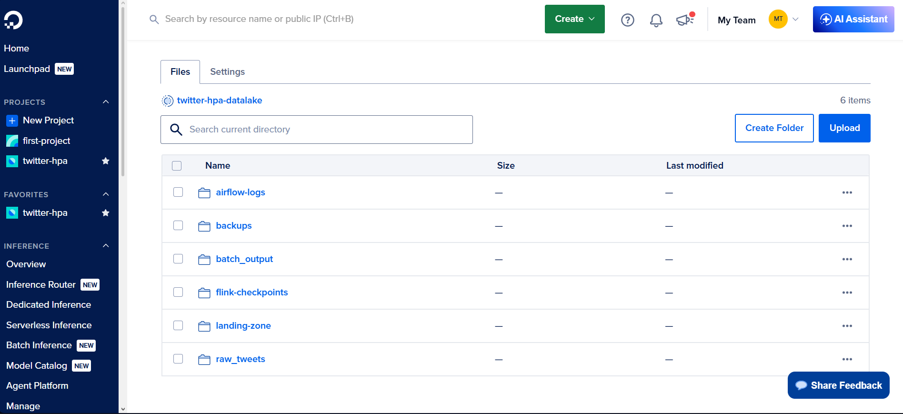

### 5b. `raw_tweets/` — Parquet Data Lake (Detay Görünüm)

> "Kafka'dan gelen ham tweet verilerinin Parquet formatında, dosya isimlerinde tarih ve zaman damgası (YYYYMMDD_HHMMSS) barındıran düz (flat) veri gölü yapısı ile saklandığı detay görünümü."

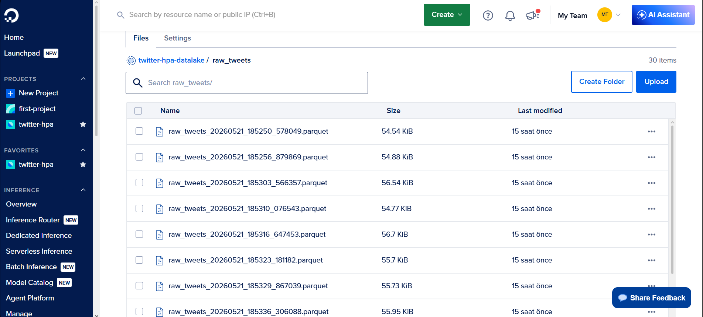

---

### 5c. `backups/` — Otomatik Veritabanı Yedekleri (Detay Görünüm)

> Her gece 03:00'te otomatik cron görevi ile yüklenen PostgreSQL (`.dump`) ve MongoDB (`.archive`) yedek dosyaları.

> MongoDB Yedekleri:
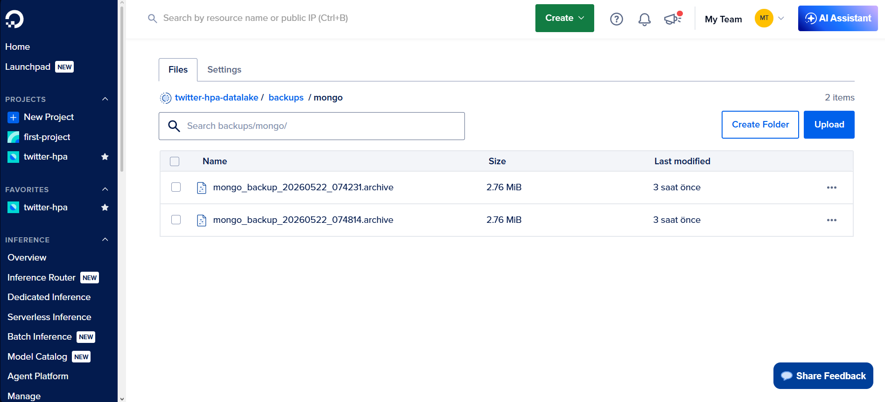

> PostgreSQL Yedekleri: 
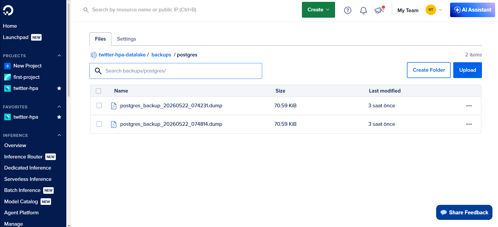

---

## 6. Serving Layer — PostgreSQL Metrikleri

> Real-time ve Batch verilerini birleştiren `unified_metrics` view'ından çekilen analitik sorgu sonuçları.

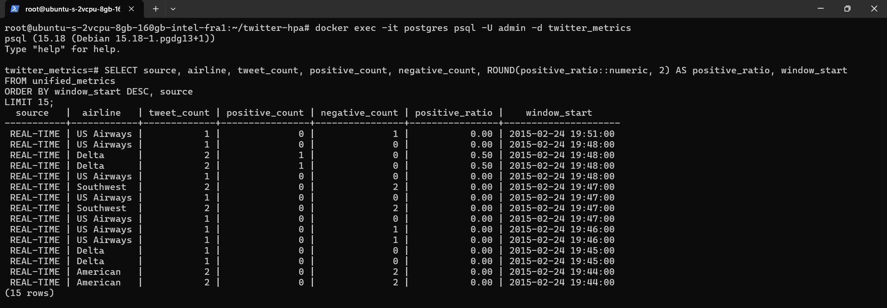

---

## 7. Serving Layer — MongoDB Kritik Alarmlar

> Flink tarafından tespit edilen "negative" tweet alarmlarının MongoDB Shell (mongosh) üzerinden çekilen JSON döküman yapısı detay görünümü.

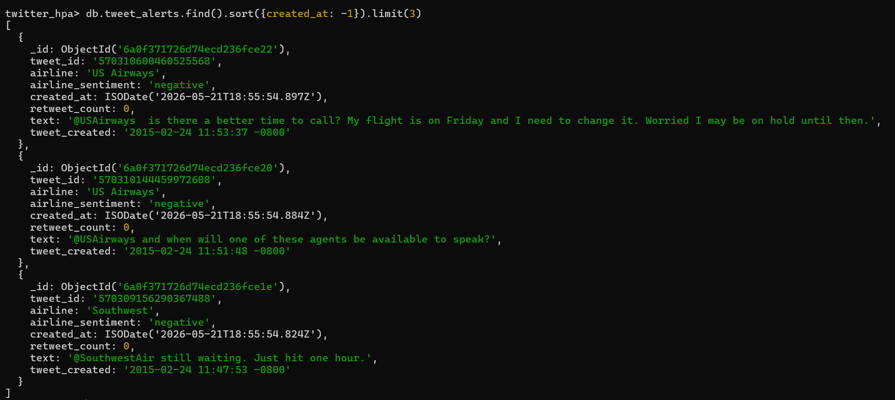

---

## 8. Cloud Hosting — DigitalOcean Droplet & Sistem Kaynakları 

> Projenin sunucu tarafındaki CPU, RAM (ve Swap) durumunu ve konteynerlerin kaynak tüketimini gösteren canlı performans verileri.

### 8a. Konteyner Kaynak Tüketimi (`docker stats`)
> DigitalOcean Droplet üzerinde çalışan 15 konteynerin anlık CPU ve RAM kullanım dağılımı.

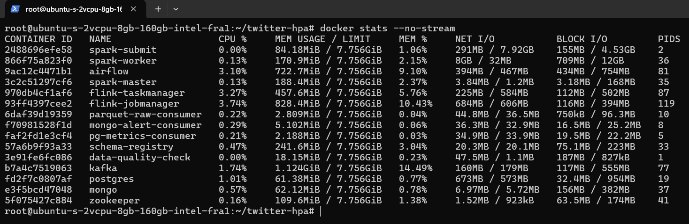

---

### 8b. DigitalOcean Droplet Konsolu
> DigitalOcean bulut panelindeki Droplet'inizin CPU, Disk ve Bant genişliği kullanım grafiklerini gösterir.

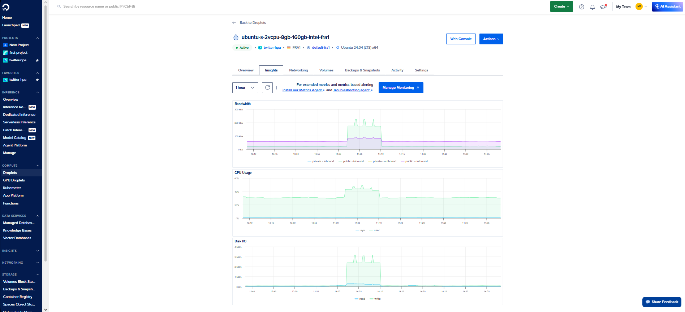